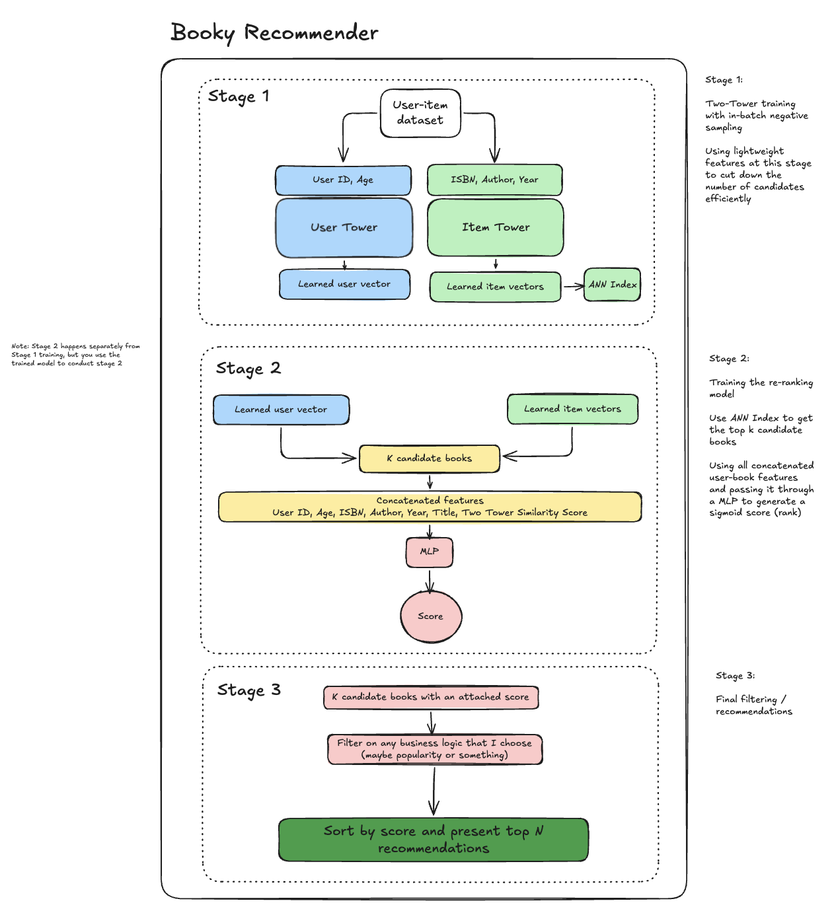

# booky

## Summary

I use a Two-Tower model to generate personalized book recommendations. During training, I include my own book interaction data so the model can learn a personalized User embedding that reflects my reading preferences.

After training, I extract and store all learned item embeddings in a vector index to enable fast similarity search. At inference time, the system computes a user’s embedding vector and performs an inner product with the item embeddings in the index to generate similarity scores for each book.

The model achieves approximately 31% Recall@25 on the test set across all users, and in my own manual evaluations, the recommendations are qualitatively strong and aligned with *most* of my reading preferences.

## In Development

Currently developing a full-stack application for **Booky** — a platform for people to discover new books. The old code for this project lives in `ml/notebooks/two_towers_final_edition.ipynb`. 

- CI/CD:
    - Continuous integration (CI) with GitHub Actions (linting and tests where applicable)
    - Contunuous deployment (CD) is one of the last steps that I will focus on. But I hope to use this project as a way to learn how to automatically build and deploy my work.

- UI/Backend:
    - The `homepage` will display personalized recommendations powered by a two-towers model serving as the online recommender system. It will also surface other recommendation types such as trending books, bestsellers, and books filtered by favorite genre(s).
    - The `admin page` will allow users to track details about books they have read along with their ratings. This data will inform future recommendation systems and be used for offline model training to keep recommendations current.

- Architecture / Machine Learning:
    - *Scalability and latency are the two primary areas of focus*.
    - To improve scalability, I plan to implement a multi-stage recommender pipeline that first narrows a large candidate pool down to 500–5,000 items, then applies a richer feature set to the reduced candidates in a ranking model. A final reranking pass will apply any necessary business logic before surfacing recommendations to the user.
    - Latency will benefit from the restructuring described above, and will be further improved through caching — rather than running inference on every request, user-item pairs will be cached for efficiency. Additionally, an approximate nearest-neighbor (ANN) search will eliminate the need for exhaustive similarity comparisons between user embeddings and all items.

Note: My full-time job takes priority over this side project, and I will do my best to develop this out when I have chances on weekends. 


## Directory

```
booky/
├── ml/                                                         
│   ├── artifacts  // git ignored                                              
│   ├── data // git ignored                                           
│   ├── notebooks/                                              # Contains the initial two-tower model code through inference (refactoring)
│   │   └── two_towers_final_edition.ipynb                      
│   ├── requirements.txt
│   └── src/
│       ├── train.py                                            # Training functionality
│       ├── models/                                             # Class definitions for the two-tower models
│       │   └── two_towers.py
│       └── utils/                                               
│           ├── config.py                                       # Global config variables encapsulated in a Config() class
│           ├── dataset.py                                      # helper functions for dataset-related things / contains 
│           ├── metrics.py                                      # helper functions for metric calculations 
│           └── preprocess.py                                   # helper functions for processing any data
├── pyproject.toml
├── makefile
└── README.md
```

## Booky Design



## Citation

I am using datasets to train these models from UCSD datasets.

```
Ups and downs: Modeling the visual evolution of fashion trends with one-class collaborative filtering
R. He, J. McAuley
WWW, 2016

Image-based recommendations on styles and substitutes
J. McAuley, C. Targett, J. Shi, A. van den Hengel
SIGIR, 2015

Mengting Wan, Julian McAuley, "Item Recommendation on Monotonic Behavior Chains", in RecSys'18. [bibtex]

Mengting Wan, Rishabh Misra, Ndapa Nakashole, Julian McAuley, "Fine-Grained Spoiler Detection from Large-Scale Review Corpora", in ACL'19. [bibtex]
```
